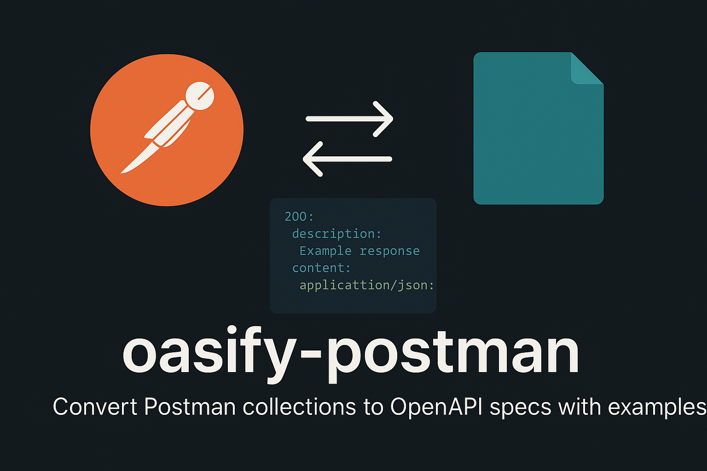

# <svg width="40" height="40" viewBox="0 0 24 24" style="display: inline-block; vertical-align: middle; margin-right: 8px;"><path fill="#8bc34a" d="M10.86 4.29h-.36a9 9 0 0 0-1.11.12h-.03l-.24.05l-.09.02l-.15.03h-.03a9 9 0 0 0-2.12.8l-.13.07l-.16.09l-.11.06h-.01l-.03.03l.09.15l2.63 4.36l.15-.09a4 4 0 0 1 .16-.08a3.6 3.6 0 0 1 1.18-.33a4 4 0 0 1 .36-.02V4.3zM5.98 5.75L5.61 6a9 9 0 0 0-.76.63l3.72 3.72l.02.02l.12-.1l-.01-.02zm8.47 7.4l-.01.17l-.01.18a3.57 3.57 0 0 1-.8 1.92l-.11.13c-.04.04-.08.1-.13.13l3.73 3.73l.12-.13l.12-.13a9 9 0 0 0 .76-.94l.03-.03l.15-.23l.03-.06a8.83 8.83 0 0 0 1.37-4.39v-.18l.01-.18h-5.26zM2 13.5v.08l.01.15l.02.23V14l.02.19v.02l.03.2c.06.42.15.84.27 1.25l.07.2v.01l.06.19l.02.04l.05.15l.03.07l.04.12l.04.1l.04.09l.05.12l.04.07l.06.14l.02.04l.08.16l.01.03l.1.17l.02.04l4.5-2.71l.03-.01a3.6 3.6 0 0 1-.33-1.18zM7.78 15l-4.51 2.7l.21.34l.01.01l.01.02l.02.03l.24.34h.01v.01l.11.15l.02.02l.12.14l.02.03l.11.13l.05.06l.1.1l.05.06l.02.02l.07.08l.03.03l.12.13l3.73-3.73a4 4 0 0 1-.13-.13l-.11-.13l-.1-.13l-.1-.14l-.1-.15zm4.93 1.22l-.16.08a3.6 3.6 0 0 1-1.7.43a3.6 3.6 0 0 1-1.03-.15l-.16-.05a3 3 0 0 1-.17-.07L7.62 21l-.07.18l-.07.15h.02l.01.01l.14.05l.17.07c.03 0 .05.02.08.03a9 9 0 0 0 1.8.43l.08.01l.08.01l.14.02h.04a9 9 0 0 0 .38.03h.44a9 9 0 0 0 1.47-.11h.02l.15-.04l.1-.01l.23-.05a9 9 0 0 0 2.15-.8l.14-.08l.15-.08l.1-.06h.01l.01-.01l.04-.02l-.1-.15l-.09-.16z"/><path fill="#689f38" d="M11.21 4.3v5.27a3.7 3.7 0 0 1 .8.17l3.89-3.88a9 9 0 0 0-.44-.29h-.02l-.14-.1l-.09-.04l-.08-.05l-.14-.07l-.02-.02a9 9 0 0 0-.95-.42l-.03-.01l-.21-.08A9 9 0 0 0 12 4.36l-.08-.01h-.07l-.14-.02h-.05l-.17-.02h-.06l-.15-.01zM4.6 6.87L4.47 7l-.12.13a9 9 0 0 0-.75.93l-.04.05a6 6 0 0 0-.15.23l-.03.04a8.83 8.83 0 0 0-1.37 4.4v.17l-.01.18h5.26l.01-.18l.01-.17a3.57 3.57 0 0 1 .8-1.92c.03-.05.08-.09.12-.13c.04-.05.07-.1.12-.14L4.6 6.88zM18.14 8.1l-3.89 3.89c.1.26.15.52.18.8h5.28v-.08l-.02-.14v-.07l-.01-.17v-.04l-.03-.2v-.01l-.03-.21a9 9 0 0 0-.27-1.24v-.01l-.06-.2l-.07-.19l-.01-.04a6 6 0 0 0-.08-.22l-.05-.12l-.04-.1l-.04-.1l-.05-.11l-.1-.21l-.02-.04l-.08-.17V9.1l-.1-.17v-.01a9 9 0 0 0-.5-.82zm-5.01 7.82l-.13.1l.01.01l2.72 4.5l.37-.25a9 9 0 0 0 .76-.63l-3.72-3.71zm-4.55 0l-.01.02l-3.72 3.71l.06.06l.1.1c.02 0 .04.02.06.04l.13.1l.03.03l.15.12l.01.02l.16.12a9 9 0 0 0 .7.47l.03.02a9 9 0 0 0 .45.25l.02.01a8 8 0 0 0 .4.2l.14-.32l1.87-4.54v-.02a3.6 3.6 0 0 1-.58-.39"/><path fill="#424242" d="M19.53 2a2.46 2.46 0 0 0-1.74.72a2.47 2.47 0 0 0-.47 2.84l-5.37 5.37a2.47 2.47 0 1 0 1.12 1.12l5.37-5.37a2.47 2.47 0 0 0 2.84-3.96A2.46 2.46 0 0 0 19.53 2"/></svg> Oasify Postman

<div align="center">
  
  
  [](https://badge.fury.io/js/oasify-postman)
  [](https://opensource.org/licenses/MIT)
  [](https://nodejs.org/)
  [](https://swagger.io/specification/)
</div>

**Convert Postman collections to OpenAPI specifications with example responses automatically injected.**

## ✨ Features

- 🔄 **Convert Postman collections** to OpenAPI 3.0 specifications
- 📝 **Automatic example injection** from saved Postman responses
- 🎯 **Customizable API metadata** (title, description, version, tags)
- 📁 **YAML output** for easy integration with documentation tools
- 🖥️ **Command-line interface** for quick conversions
- 📚 **Programmatic API** for integration into build processes

## 📋 Table of Contents

- [Installation](#-installation)
- [Quick Start](#-quick-start)
- [CLI Options](#-cli-options)
- [API Reference](#-api-reference)
- [Requirements](#-requirements)
- [Example Output](#-example-output)
- [Contributing](#-contributing)
- [License](#-license)

## 📦 Installation

### Local Installation (Library) - **Recommended**
```bash
npm install oasify-postman
```

### Global Installation (CLI)
```bash
npm install -g oasify-postman
```

## 🎯 Demo

<div align="center">
  <strong>Transform your Postman collections into professional OpenAPI documentation in seconds!</strong>
</div>

**Before (Postman Collection):** Raw JSON with saved responses
**After (OpenAPI Spec):** Beautiful, interactive API documentation with examples

## 🚀 Quick Start

### Programmatic Usage - **Recommended**

```javascript
const { generateSwagger } = require('oasify-postman');

async function convertCollection() {
  try {
    await generateSwagger('collection.json', 'swagger.yaml', {
      defaultTag: 'API',
      info: {
        title: 'My API',
        description: 'My awesome API description',
        version: '1.0.0'
      }
    });
    console.log('✅ Conversion completed successfully!');
  } catch (error) {
    console.error('❌ Conversion failed:', error.message);
  }
}

convertCollection();
```

### Command Line Usage

**Basic conversion:**
```bash
oasify-postman collection.json swagger.yaml
```

**With custom API information:**
```bash
oasify-postman -t "My Awesome API" -d "API for managing users and posts" -v "2.0.0" collection.json api.yaml
```

**Quick test with example collection:**
```bash
# Download example collection
curl -o example.json https://raw.githubusercontent.com/your-repo/example-collection.json

# Convert to OpenAPI
oasify-postman example.json api-docs.yaml
```

## 📖 CLI Options

| Option | Short | Description | Default |
|--------|-------|-------------|---------|
| `--help` | `-h` | Show help message | - |
| `--title` | `-t` | API title | "API Documentation" |
| `--description` | `-d` | API description | "API documentation generated from Postman collection" |
| `--version` | `-v` | API version | "1.0.0" |
| `--tag` | `-g` | Default tag for endpoints | "General" |

### Usage Examples

```bash
# Basic conversion
oasify-postman my-api.json api.yaml

# Custom API information
oasify-postman -t "User Management API" -d "Complete user management system" -v "1.2.0" users.json users-api.yaml

# With custom default tag
oasify-postman -g "Users" -t "User API" users.json users.yaml
```

## 🔧 API Reference

### `generateSwagger(inputFile, outputFile, options)`

Converts a Postman collection to OpenAPI specification.

#### Parameters

- `inputFile` (string): Path to Postman collection JSON file
- `outputFile` (string): Path to output OpenAPI YAML file
- `options` (Object): Conversion options
  - `defaultTag` (string): Default tag for endpoints
  - `info` (Object): API information
    - `title` (string): API title
    - `description` (string): API description
    - `version` (string): API version

#### Returns

Promise that resolves when conversion is complete.

#### Example

```javascript
const options = {
  defaultTag: 'Users',
  info: {
    title: 'User Management API',
    description: 'Complete user management system',
    version: '2.0.0'
  }
};

await generateSwagger('users.json', 'users-api.yaml', options);
```

### `injectExampleResponses(postmanFile, openapiFile)`

Injects example responses from Postman collection into OpenAPI specification.

#### Parameters

- `postmanFile` (string): Path to Postman collection file
- `openapiFile` (string): Path to OpenAPI YAML file

#### Returns

Promise that resolves when injection is complete.

#### Example

```javascript
await injectExampleResponses('collection.json', 'api.yaml');
```


## 📋 Requirements

- **Node.js** 14.0.0 or higher
- **Postman collection** with saved responses (for example injection)
- **Proper URL format** in collection (e.g., `"https://api.example.com/endpoint"`)

## ⚠️ Troubleshooting

### Common Issues

**❌ "Invalid URL format" error**
- Ensure your Postman collection has proper URL format
- URLs should be complete (e.g., `https://api.example.com/users` not just `/users`)

**❌ "No examples found" warning**
- Make sure your Postman collection has saved responses
- Export collection with "Save responses" option enabled

**❌ "Permission denied" error**
- Check file permissions for input/output files
- Ensure you have write access to the output directory

### Getting Help

- 📖 Check the [example collection](example-collection.json) for reference
- 🐛 Report issues on GitHub
- 💬 Ask questions in discussions

## 📝 Example Output

### Before vs After

| Aspect | Postman Collection | OpenAPI Specification |
|--------|-------------------|----------------------|
| **Format** | JSON | YAML |
| **Examples** | Saved responses | Injected examples |
| **Documentation** | Basic | Interactive |
| **Integration** | Manual | Auto-generated |
| **Standards** | Proprietary | OpenAPI 3.0 |

### Sample Output

Input Postman collection with saved responses generates an OpenAPI spec like:

```yaml
openapi: 3.0.0
info:
  title: My API
  description: API documentation generated from Postman collection
  version: 1.0.0
paths:
  /users:
    get:
      tags:
        - General
      responses:
        '200':
          description: Example response for Get Users
          content:
            application/json:
              example:
                users:
                  - id: 1
                    name: "John Doe"
                    email: "john@example.com"
```

**💡 Pro Tip:** Your Postman collection should have proper URL format (e.g., `"https://api.example.com/endpoint"`) for the converter to work correctly.

## 🤝 Contributing

We welcome contributions! Here's how you can help:

### 🚀 Quick Start

1. **Fork** the repository
2. **Create** a feature branch (`git checkout -b feature/amazing-feature`)
3. **Commit** your changes (`git commit -m 'Add amazing feature'`)
4. **Push** to the branch (`git push origin feature/amazing-feature`)
5. **Open** a Pull Request

### 🎯 Areas to Contribute

- 🐛 Bug fixes
- ✨ New features
- 📚 Documentation improvements
- 🧪 Test coverage
- 🔧 Performance optimizations


## 📄 License

This project is licensed under the MIT License - see the [LICENSE](LICENSE) file for details.

## 🙏 Acknowledgments

- Built on top of [postman-to-openapi](https://github.com/joolfe/postman-to-openapi)
- Uses [yamljs](https://github.com/jeremyfa/yaml-js) for YAML processing
- Inspired by the need for better Postman-to-OpenAPI conversion tools

---

<div align="center">
  <strong>Made with ❤️ by Win Khant Aung</strong>
</div>
